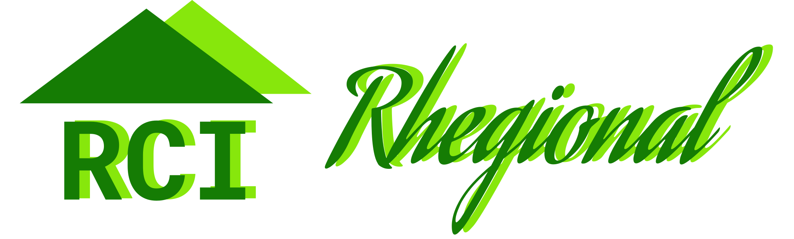

# Rhegional Site

## :dart: Objetivo

Este projeto foi criado com o objetivo de conhecer, treinar algumas das tecnologias usadas no mesmo e aplicá-las de uma forma útil.

## :star: Destaques

Durante este projeto consegui criar um **carrossel** simples, usando **Javascript Vanilla**.

## :package: Tecnologias utilizadas

- [Next](https://nextjs.org/)
- [Prettier](https://prettier.io/)
- [Eslint](https://eslint.org/)
- [Typescript](https://www.typescriptlang.org/)
- [Sass](https://sass-lang.com/)
